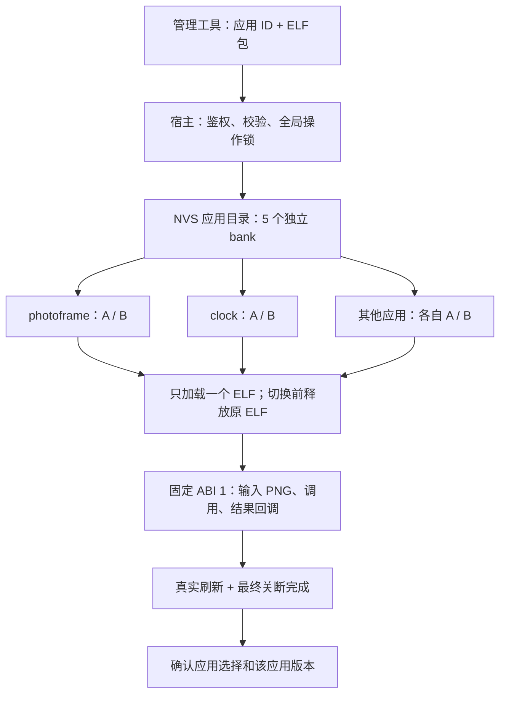

# 多 Wi-Fi 与多应用管理

本次在独立 ELF 架构上迁移 `ai-quota-frame` 的 `055467016fcc5b6eca8a3bc39e7c18f93120c9d6` 多 Wi-Fi 行为，并增加多个应用独立安装、切换、更新和 A/B 回退。实现位于 `photopainter-host`，不需要把旧整机固件作为构建基础。

## Wi-Fi 配置

SD 卡的 `config/wifi.json` 继续使用原格式：

```json
{"version":1,"networks":[
  {"ssid":"Home-2.4G","password":"replace-home-password"},
  {"ssid":"Office-2.4G","password":"replace-office-password"}
]}
```

最多 10 组，数组顺序为优先级。SSID 为 1–32 UTF-8 字节，不允许控制字符；密码为空、8–63 个可打印 ASCII 字符或 64 位十六进制 PSK。重复 SSID、重复 JSON 键、嵌入 NUL、超深或超过 8192 字节的文件均被拒绝。修改优先级或密码后重启生效。

启动优先读取 SD 文件；主文件不存在时允许读取 `.bak`。合法空列表是明确的空配置；损坏主文件不会被 `.bak` 或 NVS 掩盖。没有卡或没有配置文件时读取 NVS `wifi_profiles`，只有该键不存在才兼容原 `wifi_ssid` / `wifi_pass` 单组配置。NVS 多组数据同样经过校验。

SD 只在启动时挂载、读取或首次迁移 Wi-Fi 配置后卸载，不格式化、不访问照片；SDMMC 引脚来自官方 PhotoPainter `a5e8f757ba0c` 的 `sdcard_bsp.h`：CLK 39、CMD 41、D0 40、D1 1、D2 2、D3 38。SD 与面板 SPI 总线分开。板上没有卡检测信号，初始化命令超时按无卡处理，其他挂载错误会停止配网并保留原数据。

连接由一个常驻任务管理，每组等待连接/IP 最多 20 秒；明确断线或连接错误可提前尝试下一组。连接成功后保持当前网络；断线后从最高优先级重新尝试。全部失败等待 5 秒后重新遍历，永不因连接失败删除凭据。Wi-Fi 保持 `WIFI_PS_NONE`。

首次缺少 JSON 和 `.bak` 时，会先从合法 NVS 多组列表或旧单组配置迁移；没有 NVS 网络配置时，再读取卡根目录旧 `wifi.txt`（SSID 与密码各一行，支持 CRLF、开放网络）。创建 `config` 目录后，将完整 JSON 写到 `.tmp`，flush/fsync 后发布；更新保存时先保留 `.bak`，发布成功才清理。中断留下的 `.tmp` 不会被当成合法配置。坏文件、损坏 NVS、写入失败不会被静默覆盖或视为成功。SD 列表不会反向覆盖 NVS；拔卡后使用原 NVS。

同名 SSID 更新密码、追加新 SSID、移除和调整优先级由配套文件管理工具提供；保留其他网络和原顺序。旧整机固件的 AP 配网页面没有复制到独立宿主，恢复入口是 SD 配置文件和串口工具；网络全部不可用时持续有间隔地重试。相册、SD 图片缓存和深睡也没有引入。

```bash
# private-network.env 含 WIFI_SSID / WIFI_PASSWORD，值不会出现在参数或输出中。
python3 tools/wifi_profiles.py upsert --file /Volumes/SD/config/wifi.json --config /private/path/private-network.env
python3 tools/wifi_profiles.py move --file /Volumes/SD/config/wifi.json --index 2 --to 1
python3 tools/wifi_profiles.py remove --file /Volumes/SD/config/wifi.json --index 2
python3 tools/wifi_profiles.py status --file /Volumes/SD/config/wifi.json
```

管理工具采用相同的 `.tmp`/`.bak` 发布规则；已有主文件损坏时拒绝修改，不能通过备份掩盖。序号从 1 开始。移除最后一个网络会保存明确的空列表。编辑卡前关机取卡并备份，完成后插回设备重启。

无卡部署可将同格式的私有文件写入 NVS：

```bash
python3 tools/provision.py --config secrets.env --wifi-json /private/path/wifi.json \
  --generate-only /private/path/config.nvs.bin
# 核对设备并备份 Flash 后：
python3 tools/provision.py --config secrets.env --wifi-json /private/path/wifi.json \
  --port /dev/cu.YOUR_DEVICE
```

`PUSH_TOKEN` 仍只从 `secrets.env` 提取，不从 SD 导入。本工具重建网络 NVS 分区；应用目录使用另一分区，不受影响。真实 JSON、密码和 NVS 镜像不要入库。

## 应用目录与存储分配

应用 ID 是 1–31 个小写字母、数字、`_` 或 `-`，与版本号分开。当前硬件提供 5 个固定 bank，每个 bank 的 A/B 各 1 MiB；应用包最大 1 MiB（包含 4 KiB 头）。目录将 ID 映射到 bank，安装新应用分配空闲 bank，移除后可复用。固定分配避免碎片整理时搬动活动应用；超过五个应用或槽大小会明确拒绝。

| 分区 | 起始地址 | 大小 | 用途 |
|---|---:|---:|---|
| `nvs` | `0x9000` | `0x6000` | Wi-Fi 与入站令牌 |
| `factory` | `0x10000` | `0x500000` | 独立宿主固件 |
| `elf_a` / `elf_b` | `0x510000` / `0x610000` | 各 `0x100000` | bank 0，原 photoframe A/B |
| `elf_state` | `0x710000` | `0x6000` | 原子应用目录与状态日志 |
| `app_slots` | `0x720000` | `0x800000` | bank 1–4，各两个 1 MiB 槽 |

新增 bank `i`（1–4）的槽 `s`（A=0/B=1）地址为 `0x720000 + ((i-1)*2+s)*0x100000`，末端 `0xf20000`，不超过 16 MiB。

目录使用 NVS 命名空间 `module` 的 `catalog` blob，记录每个应用的 `active/previous/pending/trial`、已确认选中应用 `selected` 和全局候选 `trial_app`。整个目录一次提交；不擦除损坏日志。首次启动从旧 `state` 导入 `photoframe` 的原 A/B 状态，保留旧键用于迁移审计；已有损坏新目录时绝不退回旧键。

## 加载与恢复



- **stage/install**：写目标应用备用槽。先持久化目录分配及旧 fallback 失效，再擦除/写 payload、读回校验，最后写头部并登记 pending。活动槽和其他应用的字节不受影响。
- **activate**：试运行指定应用的 pending 版本，可同时从原应用切换到新应用。先持久化全局 trial 再加载，刷新成功后才确认。
- **switch**：试运行指定应用已经确认的 active 版本，不消费它尚未激活的 pending 更新。成功刷新后保存选中应用。
- **失败或确认前重启**：放弃试运行版本，恢复之前选中的已确认应用。普通切换失败不会改变目标应用自己的 A/B 版本；版本试运行失败会清除该候选。
- **rollback**：取消候选，或交换指定应用的 active/previous。可回退未运行应用而不切换当前应用。首次安装尚未确认时没有该应用自己的 fallback，恢复的是原应用。
- **remove**：只允许移除非当前且无全局试运行时的应用。先从目录移除，释放 bank；旧字节在后续分配时擦除，不会自动加载。不是安全擦除操作。

未确认的全局试运行期间，拒绝其他安装、切换或删除，必须先完成一次成功刷新或回退。PNG 校验拒绝不确认、不切换；驱动失败或缺失结果回调触发恢复。候选确认日志写入失败时保留 trial，下一次重启仍回退；推图 200 只证明物理刷新成功，确认状态应读取管理接口。

所有应用仍是受信任的原生 ELF，共享内存与硬件；不是进程或沙箱。应用应在调用返回前释放自己持有的任务/驱动资源。多个应用的代码可各自构建，但必须符合相同固定 ABI；不支持在后台同时常驻多个应用。

## 包与命令

新包 format 2 保留原 52 字节头，并在偏移 52 添加 32 字节 NUL 结尾应用 ID。其余部分填充到 4096 字节后跟 ELF。原 ELF ABI 1、长度、版本和 payload SHA-256 不变；包头 ID 必须与管理请求目标一致。format 1 的旧包只能用于 `photoframe`。SHA-256 用于完整性检测，不是签名认证；上传权限仍由设备 Bearer 令牌控制。

```bash
# 两个应用分别构建 ELF；以下路径用各自真实构建产物替换。
# 可直接使用 photoframe 仓库 examples/color-test 的独立第二应用。
python3 tools/module.py package --app clock --version 1 --input /path/to/clock.app.elf --output /tmp/clock-v1.pkg
python3 tools/module.py stage --app clock --url http://DEVICE_IP --input /tmp/clock-v1.pkg
python3 tools/module.py activate --app clock --url http://DEVICE_IP
python3 tools/module.py push --app clock --url http://DEVICE_IP --input /path/to/frame.png
python3 tools/module.py status --url http://DEVICE_IP

# 更新 clock 的另一个槽；其他应用的版本不受影响。
python3 tools/module.py package --app clock --version 2 --input /path/to/new-clock.app.elf --output /tmp/clock-v2.pkg
python3 tools/module.py stage --app clock --url http://DEVICE_IP --input /tmp/clock-v2.pkg
python3 tools/module.py activate --app clock --url http://DEVICE_IP
python3 tools/module.py push --app clock --url http://DEVICE_IP --input /path/to/frame.png

python3 tools/module.py switch --app photoframe --url http://DEVICE_IP
python3 tools/module.py push --app photoframe --url http://DEVICE_IP --input /path/to/frame.png
python3 tools/module.py rollback --app clock --url http://DEVICE_IP
python3 tools/module.py remove --app clock --url http://DEVICE_IP
```

HTTP 管理保持 `/api/module`、端口 80、原 Bearer。上传用 `POST /api/module?app=clock`，操作加 `&op=activate|switch|rollback|remove`，GET 列出全部应用。原省略 `app` 的管理操作默认为 `photoframe`。

推图保持 `POST /api/push`，可带 `X-PhotoPainter-App: clock`；省略时明确指向 `photoframe`。若目标未运行则返回 409，且不操作显示器。这使现有额度定时推送在其他应用运行时不会误投图片。

状态的 `selected/trial_app/loaded_app` 是 bank 索引，`apps[].id` 提供对应名称；`versions` 按 A/B 顺序显示经过包头、ID、payload SHA 与 ELF 结构校验的版本，无法读出有效包时为 null。版本存在不等于该槽已通过实体刷新确认，须结合 active/previous/pending。旧顶层 active 等字段描述当前运行应用。

## 从旧双槽宿主升级

本次新增分区表和宿主代码，不能只上传一个 ELF。先停止自动推图，识别设备并重新完整备份 Flash；若有 SD，备份卡上的文件。核对 Flash 地址后只写分区表与宿主：

```bash
idf.py build
python3 -m esptool --chip esp32s3 --port /dev/cu.YOUR_DEVICE write-flash \
  0x8000 build/partition_table/partition-table.bin \
  0x10000 build/photopainter_host.bin
```

不写旧槽、网络 NVS 或 `elf_state`；首次新宿主启动会导入原日志。首次全新设备的种子部署仍见 [旧双槽文档](docs-module-slots.md)，但使用当前分区表。升级后不要直接降级旧宿主：它不理解新目录，可能使用已经过时的旧 `state`；若需整机恢复应按已备份镜像完整恢复。

本地验证包括 C 状态机、实际加载器调用层（模拟 Registry ELF 执行）、C JSON 解析、NVS 包格式及 ESP-IDF 构建。模拟执行不等于真机刷新。SD 卡与两个真实网络的切换、设备断电、多应用物理刷新仍需各自实机验收记录。
