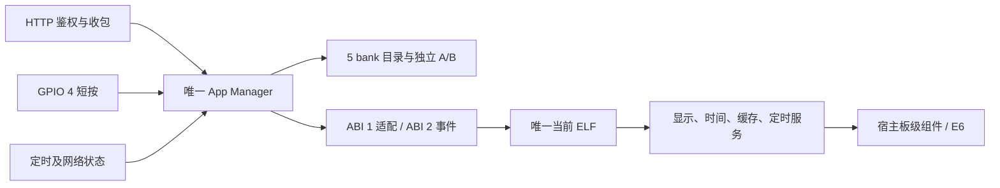

# 应用运行层 ABI 2 使用与维护

本页描述已实现的运行接口。真机部署版本、已通过项目与未验收项见 [本轮验收记录](docs/validation-runtime-v2.md)。固定使用 ESP-IDF `5e6f53cdb31fe5708eae3f55af9737be2822db22` 与未修改的 Registry elf_loader 1.3.3。

## 安装数量和切换

最多安装 **5 个应用**，每个应用有独立的 A/B 两个 1 MiB 槽；4096 字节包头包含在槽大小内。A/B 是同一应用的两个版本，不是额外应用。任意时刻只加载、执行一个 ELF，分区表和原目录布局没有改变。

GPIO 4 功能键为低有效、上拉输入。短按并松开会按 bank 顺序循环切到下一个有 active 版本的 ABI 2 应用，并等待目标自己的 START 首屏。只有一个候选时不刷新。该键不会激活 pending 更新，也不会修改 Wi-Fi。BOOT（GPIO 0）和电源键（GPIO 5）不参与切换。

- 消抖 30 ms；稳定按下 50–小于 600 ms，稳定释放后触发一次。
- 启动时按住、长按、连续抖动不会连发。
- 收图、刷屏、写包、Wi-Fi 配置操作或已有切换期间的手势被忽略，不排队补刷；请等待刷新完成再按。
- ABI 1 只能由 CLI 选择，因为它没有自主首屏，切入后仍要推 PNG。

CLI 使用原端口和令牌，切换不需要另外推一张触发图：

```bash
python3 tools/module.py status --url http://DEVICE_IP
python3 tools/module.py switch --app color-test --url http://DEVICE_IP
python3 tools/module.py switch --app photoframe --url http://DEVICE_IP
```

相框 START 主动恢复自己缓存的上一张逻辑帧；没有缓存时显示 `WAITING FOR IMAGE`。色带 START 自己生成黑、白、黄、红、蓝、绿六条竖带。额度服务仍只生图和推图：其他应用运行时，默认相框推送返回 409，不能抢回选择权。向当前 color-test 显式推 PNG 返回 415。

## 生命周期与职责



所有应用调用、目录变更及 SD 配置操作在同一管理任务执行。HTTP 接纳锁覆盖收包到响应，一个大请求体同时在途；队列上限 8 个描述符。作业借用的输入一直保留到调用完成，客户端断开不会取消已经开始的刷新。运行代次随加载变化；定时器切出自动取消，网络通知合并，只交付连接状态。状态快照由宿主管理；HTTP 服务本身串行处理请求，长事务期间后来的状态请求可能等待。

ABI 2 入口通过 `app_host_context_v2()` 取得 START=1、INPUT=2、TIMER=3、NETWORK_CHANGED=4、STOP=5。每次入口必须调用一次 `app_host_complete_v2()`；结果缺失、重复、错误事件 ID/代次均视为运行错误。START 必须报告 APP_READY；显示应用还必须有本次真实显示完成凭据，才能确认候选。STOP 返回后才卸载。基础逻辑看门狗 5 秒；同步显示及旧 ABI 1 调用预算 650 秒，CLI push/switch/activate/rollback 等待上限 660 秒。看门狗重启设备，不强行卸载仍在执行的代码。

宿主 SDK 原件为 [`sdk/photopainter_app.h`](sdk/photopainter_app.h)，应用仓库保存同内容副本。ABI 2 的允许导入列表由 [`sdk/abi2_imports.inc`](sdk/abi2_imports.inc) 统一供打包工具和 C 校验器读取。禁止直接导入任务、GPIO、SPI、I²C 和系统回调接口。原生应用仍共享内存；这些约束不构成进程或恶意代码沙箱。

## 冻结的 ABI 与包契约

| 内容 | 当前值 |
|---|---|
| context / result | ELF32 上 44 / 20 字节，字段均为固定宽度数值或本次借用指针 |
| manifest | 唯一只读 `.app_manifest`，128 字节；magic `0x32505041` |
| 身份/名称 | ID 1–31 个小写字母、数字、下划线或连字符；名称为 NUL 结尾可打印 ASCII，最多 63 字节 |
| 包组合 | format 1 + ABI 1（仅 photoframe）；format 2 + ABI 1 或 2 |
| 身份校验 | ABI 2 manifest ID = 包头 ID = 请求 app；payload SHA 覆盖 manifest |
| 显示 | 800×480，自左上开始逐行，每像素 1 字节；0黑、1白、2黄、3红、4蓝、5绿 |
| 输入/首屏能力 | PNG 位为 1；requires_initial_display 位为 1；未知 ABI 次版本和能力拒绝 |

逻辑帧长度必须是 384000，全部像素在硬件 I/O 前验证。宿主板级组件负责唯一一次 180° 打包，映射到 E6 代码 0/1/2/3/5/6。每事件最多一次显示，STOP 禁止显示。旧 ABI 1 仍用其 ELF 自带驱动；两条路径串行且刷新后释放总线。改 PNG 解码只更新应用；改电源、引脚或 E6 时序需要更新宿主。

打包工具根据 manifest 自动选择 ABI 2 和 format 2；无 manifest 保持 ABI 1。不要手改包头来绕过校验。已有五 bank 宿主升级本轮运行层只写 `0x10000` 的宿主固件，保留分区、NVS 和所有应用槽；先升级宿主再升级应用。ABI 2 安装后不能直接降级到只支持 ABI 1 的旧宿主。

## 缓存与时间

缓存是可失败的 RAM：每应用最多 512 KiB、合计最多 1 MiB，按应用 ID 隔离，优先回收其他应用的旧缓存；删除应用清缓存。应用提供格式版本，不匹配则失效。借用缓存仅在事件内有效，借用期间不能替换。相框缓存的是 384000 字节已显示逻辑帧（格式 1），所以不保留 5 MiB PNG 接收缓冲；缓存失败不把成功刷新改成错误。重启后 RAM 缓存消失，等待页属于正常行为。

一个应用最多一个宿主定时器，最小间隔 1000 ms，过期 tick 合并。单调时间以 ms 返回；墙上时间返回 Unix 秒，未达到合理日期时返回 0。当前没有新增授时协议，也不承诺断电后的准确时间。`examples/lifecycle` 是无显示、每秒计数的验收应用，不是完整时钟产品。

## 恢复与状态解释

开机先处理 `catalog` 未确认 trial，再处理 `elf_state` 分区中 `runtime` 命名空间的 `runtime_boot` 记录。记录包含 magic、阶段、bank、active/previous、ID 与校验和；不改原 catalog blob。active 启动前记阶段 1；回退前记阶段 2，再原子提交回退，进入 previous 前记阶段 3；成功后清为阶段 0。阶段 2 的重启可恢复目录提交，阶段 3 未完成则保持故障空闲，避免两个坏版本无限重启刷屏。损坏、身份不一致或写入失败时不进入应用。明确的成功 CLI 切换可清理旧启动故障记录。

| 管理字段 | 含义 |
|---|---|
| `ready` | 保留旧义：ELF 已加载 |
| `runtime_ready` | 已满足完整运行就绪条件；ABI 1 等首次成功推图 |
| `payload_abi` | 当前 ELF 的 ABI；顶层 `abi=1` 保留旧管理封套兼容 |
| `confirmed` | 当前就绪且不存在全局 trial |
| `display_completed` | 最近事件的宿主显示凭据；非显示事件会清除此项 |
| `generation` | 本次加载代次 |
| `phase` / `last_result` | 最近工作阶段与结果；故障空闲仍可通过鉴权管理 |
| `last_switch_source/target` | 最近 boot/http/button 来源及目标 |
| `ignored_buttons` | 被忙状态或事务变化抑制的短按计数，快照随后续事务更新 |
| `cache_bytes` / `free_psram` / `minimum_free_psram` | 缓存占用、当前及本次开机最低 PSRAM 余量 |
| `apps[].abi/inputs/button_eligible` | 已确认 active 版本能力；不会为了列名称执行第二个 ELF |

ABI 2 管理切换等待 START 和确认完成；无显示应用也能确认。ABI 1 保持首次 PNG 刷屏确认。`POST /api/push` 的 200 始终只在完整刷新与最终 POWER_OFF 等待成功后返回；管理 200 不是推图 200。令牌未配置/无效仍为 503，缺失或错误鉴权 401，超过 5 MiB 413，坏 PNG 422。网络未配置、不可达或 SD JSON 损坏不会阻止本地应用 START；损坏 JSON 仍不会暗中回退旧凭据。

## 本地验证命令

```bash
# host，固定 IDF 环境；无需兄弟仓库即可运行默认套件
idf.py build
python3 -m unittest discover -s tools -p 'test_*.py'
# 可选，加入真实应用 ELF 的 C 结构校验
PHOTOFRAME_TEST_ELF=/path/to/photoframe.app.elf python3 -m unittest discover -s tools -p 'test_*.py'
```

套件运行真实 C 的目录、manifest、双 ABI 生命周期、启动断点恢复、按键策略、缓存、板级打包及管理器；平台桩模拟 Flash/NVS、时间与 RTOS。应用仓库另外运行 PNG 原生测试和两应用入口测试。硬件按键、电源时序及视觉结果不能由这些平台桩代替。
